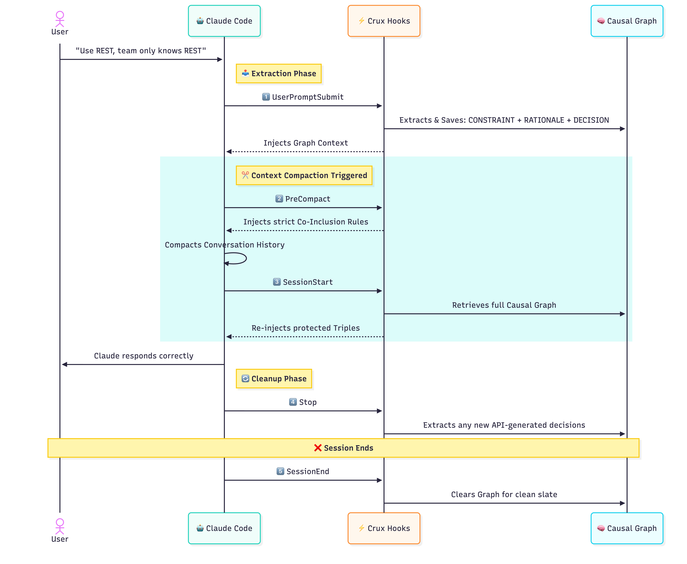

<div align="center">
  <h1>🧠 Crux for Claude Code</h1>
  <p><strong>Claude forgets <em>why</em>. Crux doesn't.</strong></p>

  [](https://docs.anthropic.com/en/docs/claude-code)
  [](https://nodejs.org)
  [](LICENSE)
  []()

  <p>Every memory tool remembers <b>what</b>. Only Crux remembers <b>why</b>.</p>
</div>

---

## 🛑 The Context Compaction Problem

You tell Claude: *"Use REST not GraphQL — our team only knows REST."*

Forty turns later, Claude suggests GraphQL.

**It remembered the decision. It forgot the reason. It ignored the constraint.**

Every other memory tool — `CLAUDE.md`, `claude-mem`, Cursor memory — stores flat facts. "Use REST."  
Claude sees "Use REST" and thinks: *that's a suggestion I can override if something better comes along.* And it does. Because nothing tells it **why REST is non-negotiable**.

---

## ⚡ How Crux Solves It (The Causal Graph)

Crux stores decisions as **causal triples**:

```text
  CONSTRAINT   ⛔  Team only knows REST — GraphQL is not an option
       ↓
  RATIONALE    💡  REST is the only viable choice given team skills
       ↓
  DECISION     ▸   Use REST not GraphQL

  ↑ These three are welded together.
    Compaction cannot drop one without dropping all.
    Claude sees the WHY every single time.
```

This is the **co-inclusion guarantee**. The reason travels with the decision. Always.

---

## 🚀 Quick Install

Crux runs as a native plugin for [Claude Code](https://docs.anthropic.com/en/docs/claude-code).  
No `npm install`. No config files. Works immediately.

```bash
# 1. Add the marketplace
/plugin marketplace add akashp1712/claude-marketplace

# 2. Install the plugin
/plugin install crux@akashp1712
```
*(Requires Node.js 18+ and Claude Code)*

---

## ✨ Features at a Glance

- **Causal Memory Graph:** Decisions are linked to their rationales and constraints.
- **Auto-Extraction:** Automatically understands decisions from normal conversation (no manual commands required).
- **Compaction Immunity:** Automatically injects co-inclusion rules right before Claude compacts context.
- **Session-Scoped:** Decisions don't permanently leak. Start a new session, get a clean slate. Promote to permanent `CLAUDE.md` only when you want.
- **Smart Deduplication:** Rephrase the same decision, Crux recognizes the semantic similarity and keeps the graph clean.
- **Multi-Mode Extraction (`CRUX_EXTRACTION_MODE`):**
  - `hybrid` (default): Fast local extraction, falls back to API when unsure (~$0.02/session).
  - `local`: 100% offline, zero-cost, regex-based engine.
  - `api`: Maximum accuracy via Anthropic's API.

---

## 🛠 Commands

| Command | Description |
|---|---|
| `/crux:status` | Inspect the current session's active decision graph. |
| `/crux:export` | Persist active session decisions to your permanent `CLAUDE.md`. |
| `use crux-query` | Ask Claude mid-conversation to check active constraints. |

---

## 🆚 Why Flat Memory Fails

| Memory Engine | Stores the WHY? | Survives Compaction? | Co-Inclusion Guarantee? |
|---|---|---|---|
| **Crux** | **Yes** (Causal Triples) | **Yes** (PreCompact re-injection) | **Yes** |
| `CLAUDE.md` | No (Flat text) | Partial (Can be summarized out) | No |
| `claude-mem` | No (Flat facts) | No | No |
| Cursor Memory | No | No | No |

---

## ⚙️ How it Works (Under the Hood)

Crux hooks directly into Claude Code's lifecycle:



1. **`SessionStart`**: Sets up the graph.
2. **`UserPromptSubmit`**: Extracts decisions from your requests.
3. **`PreCompact`**: The magic layer—injects instructions forbidding Claude from separating a DECISION from its RATIONALE/CONSTRAINT.
4. **`Stop`**: Extracts decisions made by Claude's responses.
5. **`SessionEnd`**: Cleans up.

---

## 🔮 Roadmap

### v0.2 — Conflict Detection
When you say "Use PostgreSQL" and later say "Use MongoDB", Crux will flag it: *"This contradicts your earlier decision."* Plus manual commands (`/crux:add`, `/crux:supersede`).

### v0.3 — Expanded Graph & Teams
12 atom types (GOAL, PROBLEM, SOLUTION, etc.). Git-committable graph for team-shared decisions. Per-directory scoping for monorepos.

### v1.0 — The Proxy
`crux-proxy` binary intercepts Anthropic API traffic directly. Token-exact compaction control. No hooks needed — 100% protocol-level co-inclusion guarantee.

---

## 🤝 Troubleshooting & Config

| Variable | Default | Description |
|----------|---------|-------------|
| `CRUX_EXTRACTION_MODE` | `hybrid` | `local` / `api` / `hybrid` |
| `ANTHROPIC_API_KEY` | — | Required only if using `api` or `hybrid` mode. |

**No decisions extracting?** Ensure `CRUX_EXTRACTION_MODE` is set, or check your API key if using full extraction.  
**Decisions gone?** Crux is session-scoped. Run `/crux:export` before quitting to save to `CLAUDE.md`.  
**Not firing?** Run `claude --plugin-dir ./crux`, hit `Ctrl+o` for verbose logs.

---

<div align="center">
  <p>Built with ❤️ by <a href="https://github.com/akashp1712">Akash Panchal</a></p>
  <p>Licensed under <b>MIT</b></p>
</div>
